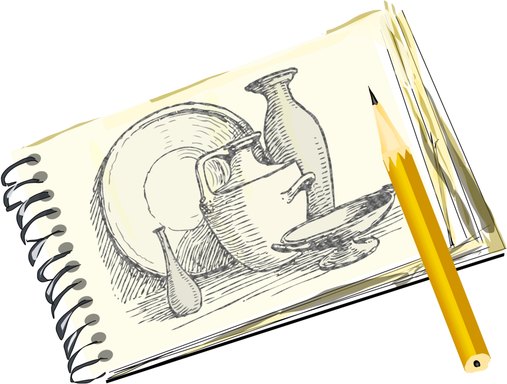

# AboutMe
<body>

<h1> <i>Who are you?</i> </h1>

 Hello, I'm Aaron Pan, and I'm currently a <strong>Sophomore</strong> at Whitney High School! 

 I like to learn how to code in the future and be better at it. 

</body>

[My Previous Made Game](https://studio.code.org/projects/gamelab/un1CttFp9iIa-9I0eqtwAO6dAjURGjbGpKruMvndesg)

<body>
  
<h2> <i>Favorite things to do:</i> </h2>

 I like to play video games on my freetime as well as doing mathematics to enhance my knowledge. 

 I also like to draw pictures on the internet in my free time. 
                                                                                                                                              
</body>                                                                                                                                                 

<body>
<h3> Mr. Marchant's Website </h3>

 Mr. Marchant is my amazing, 10th grade A.P. Computer Science teacher. He is really supportive and helps out with any problems that is asked to him. I really hope that I would enjoy being in Mr. Marchant's class and get to know him better throughout my Sophomore Year. 

</body>

[Mr. Marchant's Website](https://mrmarchant.com/)
